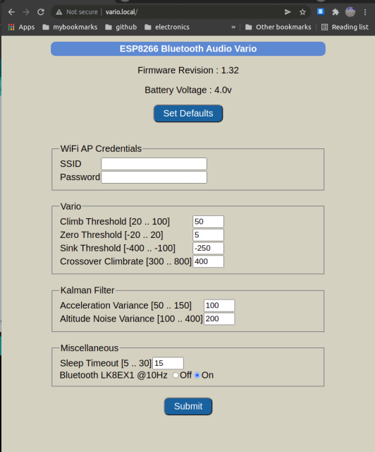
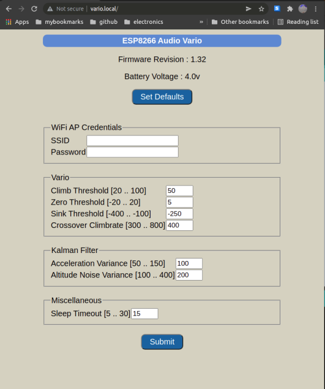

# ESP8266_BLUETOOTH_AUDIO_VARIO

## Features
* Accurate, zero-lag audio feedback variometer using Kalman filter fusion of accelerometer and pressure sensor data
* WiFi webpage configuration with the vario acting as an access point and web server.
* WiFi Over-the-air (OTA) firmware update 
* You can build a minimal audio vario with the above functionality. Or you can add optional features :
    * Bluetooth transmission of LK8EX1 sentences with a HM-11 bluetooth module. You can then use 
flight instrument apps like [XCTrack](https://xctrack.org/) on a smartphone/tablet with accurate barometric altitude and climb/sink rate data.
    * Push-pull L9110S driver with conventional loudspeakers for higher audio volume. 
    * Torch/lantern mode using a 0.5W white led. This is accessed with a long press of a button when the unit is in vario mode. Once in lantern mode, you can cycle through 3 different brightness levels and an S.O.S. flasher mode.
* PCB design with same form factor as a single-cell 18650 power bank case. 

## Software Build Environment 
* Ubuntu 20.04 LTS AMDx64
* Arduino IDE version 1.8.16
* External Arduino libraries used (install using Arduino Library Manager) : 
  * ESPAsyncTCP
  * ESPAsyncWebServer
  * AsyncElegantOTA
* [Arduino ESP8266 LittleFS Data Upload plugin](https://github.com/earlephilhower/arduino-esp8266littlefs-plugin/releases)

## Hardware

* ESP-12E/12F module (4Mbytes flash)
* CJMCU-117 10-DOF IMU module with MPU9250 and MS5611 sensors
* HM-11 Bluetooth module
* L9110S IC used as a push-pull driver for louder volume 
* Kicad used for schematic and layout
  * [Archived Kicad project](hw/esp8266_bluetooth_vario_kicad.zip)
  * [PCB layout Gerber Zip](hw/esp8266_bluetooth_vario_gerber.zip)
  * [Schematic PDF](hw/esp8266_bluetooth_vario_schematic.pdf)

[EasyEDA online visualization](https://gerber-viewer.easyeda.com/showcase) of PCB layout. 

## Hardware Notes

I have not used a pcb footprint for the HM-11 module because there are several options for this
module available on ebay/aliexpress with different pinouts, all called "HM-11".

1. HM-11 original. Make sure the pinout matches the one in the HM-10 datasheet (which includes info and pinout for HM-11). [Example.](https://www.seeedstudio.com/Bluetooth-V4.0-HM-11-BLE-Module-p-1803.html)

2. JDY-08 "HM-11" clone. This has to be reflashed with HM-10 firmware using a CC debugger adapter. 
If you do get a JDY-08, and have access to a CC debugger, here are [instructions for reflashing it and the resulting change in pinout.](https://www.iot-experiments.com/jdy-08/)

The CJMCU-117 `NCS` pin should be connected with a wire directly to the 
CJMCU-117  LDO regulator 3.3V output. The pcb already has the connection between `NCS` and `PS` (see the [schematic](hw/esp8266_bluetooth_vario_schematic.pdf)).

The 10K I2C pullup resistors on the CJMCU-117 board should be replaced with 3.3K for a reliable interface at 400kHz.

The TLV75533 3.3V LDO regulator has a high current rating of 500mA and is suitable for the ESP8266 power supply, which has high current spikes > 350mA on wifi transmit bursts. You can use it for both LDO regulators on the board. The reason I used a cheaper, more readily available XC6219 3.3V LDO regulator for the HM-11 is because the bluetooth module current draw is low.

The optional circuit components are marked with dashes on the schematic. Do not populate them if 
you don't want the torch option or the bluetooth option or the L9110s loud(er) speaker option. 

You can first test the board with a direct connection from AUD pin to a piezo speaker and the other piezo
pin connected to ground. You will have to put solder on the jumpers to select this.
If you mount the vario on your shoulder and/or have an open-face helmet, the volume level is probably enough without populating the L9110S push-pull driver circuit.

If you want louder audio, install the L9110s circuit option. If this is still not loud enough, replace the piezo transducer with a magnetic coil loudspeaker of at least 8 ohms impedance. Make sure you use at least a 47 ohm resistor for R5 to keep current pulses manageable. 
Ensure there is no air path from the front of the loudspeaker 
to back or else the front wave will cancel the back wave. 
Use silicone  to seal the edge of the speaker to the pcb, that will do the job. 
Put some soft foam tape on the back of the speaker so that vibrations don't get transmitted 
to the MPU9250 or MS5611.

Replacement speaker-phone (NOT earpiece) drivers for mobile phones are a good choice.  You can put two in series for 16ohms impedance, but make sure they are in phase.

A few components may not be readily available on Aliexpress/Ebay. You can find them on Mouser/Digikey :
* Ferrite bead 600ohms@100MHz : BLM18AG601SN1D
* TI TPS22918 high-side switch 
* Broadband piezo speaker : PUI Audio AT2310TLW100R, Kingstate KPEG006 
* Power switch : ALPS SSSS916400 (good quality, expensive) or SK12D07 (ebay, cheap, cut off the end lugs).
* For torch LEDs up to 0.5W, populate one of R1, R2 with a 22ohm 2512 0.5W package. For higher wattage LEDs, add a second resistor in parallel. 

The ESP8266 has internal power-on bootstrap pullup/pulldown requirements for some of the GPIO pins. These cause circuit quirks on reset and during ROM boot. You will find the torch LED comes on at full brightness when you press the reset button, or put the ESP8266 in program mode.

The silkscreen markings for the ESP8266 UART are for the connecting component. RXD should be connected to the RX pin on the USB-UART module, and TXD to the TX pin. 

Similarly, the silkscreen markings for the HM-11 interface are for the HM-11 module. The BTRX pad should be connected to the HM-11 RX pin. To reset the HM-11 with factory default settings, short the KEY pad to ground for a couple of seconds.

Battery current drain is `~27mA` operating as audio vario with bluetooth disabled. 

Battery current drain is `~37mA` operating as audio vario with bluetooth LK8EX1 message transmission @ 10Hz.

## Software Build Notes

* For a minimal audio vario with the ESP8266 directly driving a piezo transducer, edit the file `config.h` and set `CFG_BLUETOOTH`, `CFG_L9110S` and `CFG_LANTERN` to false.
If you want support for louder volume using the L9110S push-pull driver IC, set `CFG_L9110S` to true.   
* To support bluetooth LK8EX1 transmission with a HM-11 module,set `CFG_BLUETOOTH` to true.
* To support the torch/lantern feature, set `CFG_LANTERN` to true.
* In the Arduino IDE, select `Tools->Board->ESP8266 Boards (3.0.2) : Generic ESP8266 module`
* Select `Tools->Flash Size : 4MB (FS:1MB OTA:~1019kB)`
* Select `Tools->CPU Frequency : 80MHz`
* The first time you flash the ESP8266 with this project code, select `Tools->Erase Flash : All flash contents`. 
* Build and flash the application firmware. You should see confirmation of full chip erase before flashing the firmware.
* Select `Tools->Erase Flash : Only sketch` option. From now on, use this option whether you are uploading the LittleFS partition image or the firmware binary. 
* Select `Tools->ESP8266 LittleFS Data Upload`. This will build a LittleFS flash partition with the contents of the `/data` directory, and then flash it to the ESP8266. The `/data` directory contains the static HTML and CSS files for the WiFi server webpage.
* Select `Tools->Serial Monitor`, make sure the unit is resting horizontally on a table and reset the EP8266 module. Since there is no calibration data, you will see a calibration error message, followed by accelerometer and gyroscope calibration.
(You will not have to do anything if the unit is resting horizontally).
* The gyroscope is re-calibrated each time on power-up due to issues with drift and environmental conditions. You should leave the vario undisturbed when you hear the count-down beeps for gyroscope calibration. If the vario is disturbed during the gyro calibration process (e.g. you turn it on while in flight), it will use the last saved gyro calibration parameters.
* [This is a build and startup serial monitor log](docs/build_log.txt). 
* This project uses the KF4D kalman filter algorithm from the [ESP32_IMU_GPS_BARO_VARIO](https://github.com/har-in-air/ESP32_IMU_BARO_GPS_VARIO) project.
* To put the vario into WiFi configuration mode, switch on the vario and immediately press the `PCC` button. Keep it pressed until you hear a confirmation tone, then release. You can now connect to the WiFi Access Point `ESP8266Vario` - no password needed. Now, access the url `http://192.168.4.1` in a browser.
* Compiled with Bluetooth support

* Compiled without Bluetooth support

* To update the firmware, access the url `http://192.168.4.1/update`. 
Upload the new firmware binary `.bin` file. Reboot the vario. Select WiFi configuration mode again, and confirm the firmware revision string has changed (assuming it has been updated along with code changes).
Note : To export the compiled firmware binary file to the sketch folder, use the `Sketch->Export compiled binary` command.

